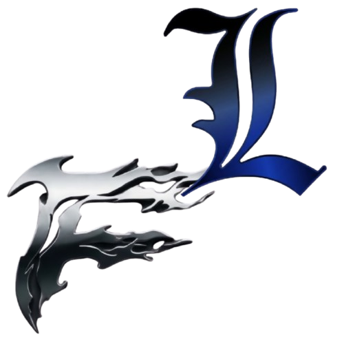
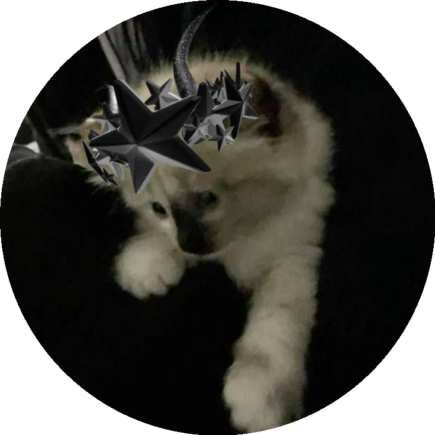

# ⚡ LeiLenWare

**The free external for Roblox — ESP, Aim Assist & Movement, by LeitosBase × FallenWare.**

 

**[Features](#-features) · [Roadmap](#-roadmap) · [Installation](#-installation) · [Contributors](#-contributors)**

---

## ⚠️ Early Development

> [!NOTE]
> LeiLenWare is in **very early development**. Features listed below with 🚧 are in progress and 📅 are planned — check the [Roadmap](#-roadmap) for the current state.

## ✨ Features

### 👁️ ESP / Wallhack 🚧
- Player, item & NPC highlighting through walls
- Boxes, skeletons, nametags, health bars & distance
- Team check and configurable colors per element

### 🎯 Aimbot / Aim Assist 🚧
- Targeting modes: closest-to-crosshair, FOV-based
- Smooth aim, FOV circle & visible-check
- Per-weapon or per-game configurations

### 🏃 Movement 🚧
- Speed, fly & noclip
- Infinite jump
- Instant teleport (waypoints & saved positions)

## 🗺️ Roadmap

| | Feature | Status |
|---|---|:---:|
| 👁️ | ESP boxes, skeletons & nametags | 🚧 WIP |
| 👁️ | Health bars, distance & team check | 📅 Planned |
| 🎯 | Aim assist with FOV & smoothing | 🚧 WIP |
| 🎯 | Visible check & per-game configs | 📅 Planned |
| 🏃 | Speed, fly, noclip & infinite jump | 🚧 WIP |
| 🏃 | Waypoint teleport & saved positions | 📅 Planned |
| 🖥️ | In-game menu (IMGUI) | 🚧 WIP |
| 🎨 | Customizable themes & accent colors | 📅 Planned |
| 📋 | Game profiles (TSB, Rivals, Blox Fruits) | 📅 Planned |
| 💬 | Discord Rich Presence | 📅 Planned |

## 📥 Installation

> [!IMPORTANT]
> **Not released yet.** LeiLenWare is still in development — the download will be available on the
> [FallenWare Discord](https://discord.gg/Dxg8Ayj4RY) or the [LeitosBase Discord](https://discord.gg/H72EbznjqP) when the first alpha drops.
> Windows 10 / 11 required.

## 👥 Contributors

Thanks to everyone who builds LeiLenWare with us! ⚡

| Contributor | Role | GitHub |
|:---:|:---:|:---:|
|  | 👑 Founder (LeitosBase) | [@LeitoQNM](https://github.com/LeitoQNM) |
|  | 🔥 Owner of FallenWare | [@Fallenware](https://github.com/Fallenware) |

## 📜 Disclaimer

> [!WARNING]
> LeiLenWare is a **fan-made tool** and is **not affiliated with, endorsed by, or connected to Roblox Corporation** in any way. Provided for educational purposes only. Use at your own risk — using cheats may violate the Roblox Terms of Service and can result in account penalties.

Made with 💙 by LeitosBase × FallenWare · © 2026

 

**[⬆ Back to top](#-leilenware)**

